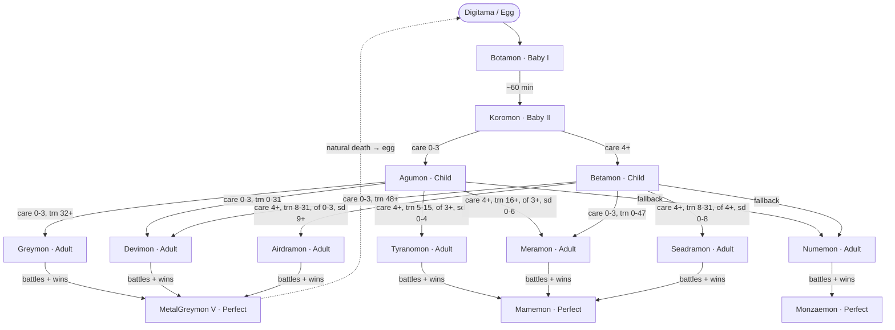
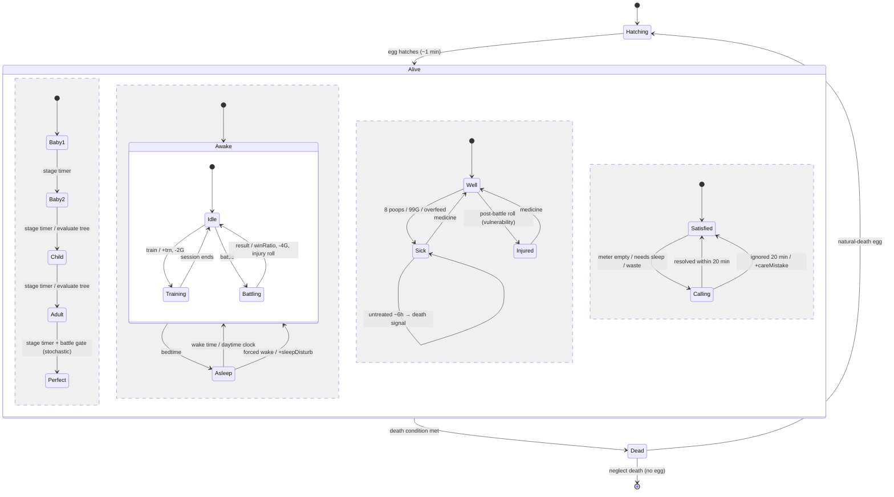

# V-Pet Visual Reference & Image-Gen Brief

Companion to `vpet-game-spec-v1.md`. Two diagram families fully specified: **(1) Lifecycle / Ver.1 Evolution Tree** and **(2) Pet Runtime State Machine**. Each is given as canonical Mermaid + structured JSON, with a ready-to-paste ChatGPT image-gen prompt.

---

## Format decision (read first)

- **Canonical source of truth = Mermaid + JSON, not the image.** Both are text, so they version in git, diff cleanly, render natively in Obsidian/GitHub, and an agent can read them directly. Keep these forever.
- **The evolution-tree JSON doubles as the engine's data file** (spec §6 — "imported as a data file"). It is not just a picture; the build imports it. Edit the JSON, the game and the diagram both update.
- ⚠️ **Image-gen caveat — do not trust a generated PNG as reference.** Diffusion/image models cannot reliably reproduce dense labeled graph topology: node labels garble, edges get invented or dropped. The PNG is a **poster for vibes**, never the spec. If you want an *accurate* raster, render the Mermaid deterministically — `mmdc -i tree.mmd -o tree.svg` (mermaid-cli) or Obsidian's built-in Mermaid render. *On your Linux box `npx @mermaid-js/mermaid-cli` is the one-liner.*
- **Recommended storage triplet per diagram:** `*.mmd` (canonical) + `*.json` (data) + `*.png` (poster). Naming convention in Part 3.

---

# PART 1 — Lifecycle / Ver.1 Evolution Tree

## 1.1 What it shows
The complete one-way progression for the Ver.1 roster (14 Digimon): egg → Baby I → Baby II → two Child branches → five Adult species per branch → three Perfect terminals. Edge labels are the hidden-counter conditions evaluated at each stage timeout. `care` = care mistakes, `trn` = training count, `of` = overfeed, `sd` = sleep disturbances. Adult→Perfect is battle-gated and stochastic.

## 1.2 Canonical Mermaid (`vpet-evolution-tree.mmd`)



> Note: the egg-rebirth dashed loop is drawn once from MetalGreymon to keep the graph legible; per spec §7 it applies to **any** Digimon that reaches natural lifespan. Death-by-neglect is terminal (no egg) and lives in the state machine (Part 2), not here.

## 1.3 Canonical JSON (`vpet-evolution-tree.json` — engine data file)
Matches the branch-row schema in spec §6. `conditions: null` = unconditional; `fallback: true` = the result when no other branch in that group matches.

```json
{
  "version": "Digital Monster Ver.1",
  "stages": ["EGG", "BABY1", "BABY2", "CHILD", "ADULT", "PERFECT"],
  "roster": {
    "BOTAMON":    { "stage": "BABY1" },
    "KOROMON":    { "stage": "BABY2" },
    "AGUMON":     { "stage": "CHILD" },
    "BETAMON":    { "stage": "CHILD" },
    "GREYMON":    { "stage": "ADULT" },
    "DEVIMON":    { "stage": "ADULT" },
    "TYRANOMON":  { "stage": "ADULT" },
    "MERAMON":    { "stage": "ADULT" },
    "AIRDRAMON":  { "stage": "ADULT" },
    "SEADRAMON":  { "stage": "ADULT" },
    "NUMEMON":    { "stage": "ADULT" },
    "METALGREYMON_V": { "stage": "PERFECT" },
    "MAMEMON":    { "stage": "PERFECT" },
    "MONZAEMON":  { "stage": "PERFECT" }
  },
  "branches": [
    { "from": "BOTAMON", "to": "KOROMON", "conditions": null },

    { "from": "KOROMON", "to": "AGUMON",  "conditions": { "careMistakes": [0,3] } },
    { "from": "KOROMON", "to": "BETAMON", "conditions": { "careMistakes": [4,99] } },

    { "from": "AGUMON", "to": "GREYMON",   "conditions": { "careMistakes": [0,3], "training": [32,999] } },
    { "from": "AGUMON", "to": "DEVIMON",   "conditions": { "careMistakes": [0,3], "training": [0,31] } },
    { "from": "AGUMON", "to": "TYRANOMON", "conditions": { "careMistakes": [4,99], "training": [5,15],  "overfeed": [3,99], "sleepDisturb": [0,4] } },
    { "from": "AGUMON", "to": "MERAMON",   "conditions": { "careMistakes": [4,99], "training": [16,999],"overfeed": [3,99], "sleepDisturb": [0,6] } },
    { "from": "AGUMON", "to": "NUMEMON",   "fallback": true },

    { "from": "BETAMON", "to": "DEVIMON",   "conditions": { "careMistakes": [0,3], "training": [48,999] } },
    { "from": "BETAMON", "to": "MERAMON",   "conditions": { "careMistakes": [0,3], "training": [0,47] } },
    { "from": "BETAMON", "to": "AIRDRAMON", "conditions": { "careMistakes": [4,99], "training": [8,31], "overfeed": [0,3], "sleepDisturb": [9,99] } },
    { "from": "BETAMON", "to": "SEADRAMON", "conditions": { "careMistakes": [4,99], "training": [8,31], "overfeed": [4,99], "sleepDisturb": [0,8] } },
    { "from": "BETAMON", "to": "NUMEMON",   "fallback": true },

    { "from": "GREYMON",   "to": "METALGREYMON_V", "conditions": { "battleGate": true } },
    { "from": "DEVIMON",   "to": "METALGREYMON_V", "conditions": { "battleGate": true } },
    { "from": "AIRDRAMON", "to": "METALGREYMON_V", "conditions": { "battleGate": true } },
    { "from": "TYRANOMON", "to": "MAMEMON",        "conditions": { "battleGate": true } },
    { "from": "MERAMON",   "to": "MAMEMON",        "conditions": { "battleGate": true } },
    { "from": "SEADRAMON", "to": "MAMEMON",        "conditions": { "battleGate": true } },
    { "from": "NUMEMON",   "to": "MONZAEMON",      "conditions": { "battleGate": true } }
  ],
  "battleGate": {
    "note": "Adult->Perfect. Requires ~15 battles AND 12-15 wins at BOTH Child and Adult, win ratio >=80%. Stochastic: success not guaranteed when met; failure holds at Adult until lifespan ends.",
    "minBattlesPerStage": 15,
    "minWinsPerStage": 12,
    "minWinRatio": 0.80,
    "guaranteed": false
  }
}
```

## 1.4 ChatGPT image-gen prompt — Evolution Tree poster
Paste verbatim. Treat the result as a **poster**, not the reference (§Format decision).

> Create a clean retro infographic poster of a creature **evolution tree**, styled as a vintage 1997 monochrome LCD virtual-pet (Tamagotchi/Digivice) reference chart. Aesthetic: pale dot-matrix LCD green background (#c3d196) with dark olive ink (#2b3318), faint horizontal scanline texture, chunky pixel-art creatures, 1-bit feel, blocky pixel/monospace lettering. Layout: strict top-to-bottom hierarchy in labeled tiers — **EGG → BABY I → BABY II → CHILD → ADULT → PERFECT** — with clean directional arrows. Reproduce this exact structure and node labels:
> - EGG "Digitama" → BABY I "Botamon" → BABY II "Koromon"
> - Koromon branches to two CHILD nodes: "Agumon" and "Betamon"
> - Agumon → ADULT: Greymon, Devimon, Tyranomon, Meramon, Numemon
> - Betamon → ADULT: Devimon, Meramon, Airdramon, Seadramon, Numemon
> - ADULT → PERFECT: Greymon/Devimon/Airdramon → "MetalGreymon"; Tyranomon/Meramon/Seadramon → "Mamemon"; Numemon → "Monzaemon"
> Each node is a small distinct pixel-monster sprite in a rounded-rect cell with its name beneath. Include a tier label down the left margin. Portrait orientation, ~3:4, high resolution, crisp edges, no photographic realism, no extra decorative text. Prioritize legible correct labels over ornamentation.

---

# PART 2 — Pet Runtime State Machine

## 2.1 What it shows
The engine's runtime behavior as a **statechart**. Top level is the lifecycle (`Hatching → Alive → Dead`, with natural-death rebirth). Inside `Alive`, four **concurrent regions** run in parallel because the original device tracks these orthogonally — a pet can be simultaneously a Champion, asleep, sick, and calling for food:
- **Stage** — evolution progression (transitions evaluate the Part 1 tree).
- **Activity** — Awake (with modal Idle/Training/Battling) ↔ Asleep.
- **Health** — Well ↔ Sick / Injured.
- **Needs** — Satisfied ↔ Calling (→ care mistake if ignored).

## 2.2 Canonical Mermaid (`vpet-state-machine.mmd`)



## 2.3 Canonical JSON (`vpet-state-machine.json`)

```json
{
  "id": "vpet-runtime",
  "initial": "Hatching",
  "states": {
    "Hatching": { "type": "simple",
      "on": { "HATCH": "Alive" } },
    "Dead": { "type": "simple",
      "on": { "REBIRTH_NATURAL": "Hatching", "END_NEGLECT": "[final]" } },
    "Alive": {
      "type": "parallel",
      "on": { "DEATH": "Dead" },
      "regions": {
        "stage": {
          "initial": "Baby1",
          "states": {
            "Baby1":   { "on": { "STAGE_TIMER": "Baby2" } },
            "Baby2":   { "on": { "STAGE_TIMER": { "target": "Child",   "action": "evaluateTree" } } },
            "Child":   { "on": { "STAGE_TIMER": { "target": "Adult",   "action": "evaluateTree" } } },
            "Adult":   { "on": { "STAGE_TIMER": { "target": "Perfect", "guard": "battleGate", "stochastic": true } } },
            "Perfect": {}
          }
        },
        "activity": {
          "initial": "Awake",
          "states": {
            "Awake": {
              "initial": "Idle",
              "states": {
                "Idle":     { "on": { "TRAIN": { "target": "Training", "action": "trainStart" },
                                       "BATTLE": "Battling" } },
                "Training": { "on": { "DONE": { "target": "Idle", "action": "trainEnd(+trn,-2G)" } } },
                "Battling": { "on": { "RESULT": { "target": "Idle", "action": "battleEnd(winRatio,-4G,injuryRoll)" } } }
              },
              "on": { "BEDTIME": "#Asleep" }
            },
            "Asleep": {
              "on": {
                "WAKE_TIME":   "Awake",
                "FORCED_WAKE": { "target": "Awake", "action": "+sleepDisturb" }
              }
            }
          }
        },
        "health": {
          "initial": "Well",
          "states": {
            "Well":    { "on": { "POOP8_OR_99G_OR_OVERFEED": "Sick", "POST_BATTLE_INJURY": "Injured" } },
            "Sick":    { "on": { "MEDICINE": "Well", "UNTREATED_6H": { "action": "DEATH" } } },
            "Injured": { "on": { "MEDICINE": "Well", "UNTREATED_6H": { "action": "DEATH" } } }
          }
        },
        "needs": {
          "initial": "Satisfied",
          "states": {
            "Satisfied": { "on": { "METER_EMPTY_OR_SLEEP_OR_WASTE": "Calling" } },
            "Calling":   { "on": {
              "RESOLVED_LE_20M": "Satisfied",
              "IGNORED_GT_20M":  { "target": "Satisfied", "action": "+careMistake" }
            } }
          }
        }
      }
    }
  },
  "deathConditions": [
    "careMistakes + injuryTotal >= 20 (one form)",
    "sicknessTotal >= 20",
    "injuryTotal >= 20",
    "sick/injured untreated ~6h",
    "meter empty ~6h (starvation)"
  ]
}
```

## 2.4 ChatGPT image-gen prompt — State Machine poster
Paste verbatim. Poster only (§Format decision); for an accurate render use the Mermaid in 2.2.

> Create a clean technical **statechart / state-machine diagram** poster styled as a vintage monochrome LCD virtual-pet engineering reference. Aesthetic: pale dot-matrix LCD green background (#c3d196), dark olive ink (#2b3318), faint scanlines, blocky pixel/monospace labels, rounded-rectangle state boxes, labeled arrows for transitions, 1-bit retro feel. Show a top-level horizontal flow: **HATCHING → ALIVE → DEAD**, with a dashed return arrow "natural-death egg" from DEAD back to HATCHING. Render **ALIVE** as a large container split into four stacked parallel lanes separated by dashed divider lines, each lane labeled:
> 1. **STAGE**: Baby1 → Baby2 → Child → Adult → Perfect (arrows labeled "stage timer / evaluate tree").
> 2. **ACTIVITY**: an "Awake" box containing Idle ↔ Training ↔ Battling, with Awake ↔ Asleep (arrow "bedtime" / "forced wake +sleepDisturb").
> 3. **HEALTH**: Well → Sick and Well → Injured, both returning via "medicine".
> 4. **NEEDS**: Satisfied → Calling → Satisfied (arrows "ignored 20 min +careMistake" and "resolved").
> Landscape orientation, ~4:3, high resolution, crisp vector-like edges, legible labels prioritized over decoration, no photographic realism.

---

# PART 3 — Storage convention (keep these together)

Suggested layout for the vault / repo so agents and Claude Design/Codex find the pair every time:

```
/design/
  vpet-game-spec-v1.md
  /diagrams/
    vpet-evolution-tree.mmd      # canonical
    vpet-evolution-tree.json     # data file (engine imports this)
    vpet-evolution-tree.png      # poster (from ChatGPT)
    vpet-state-machine.mmd       # canonical
    vpet-state-machine.json
    vpet-state-machine.png
```

- Rule: **edit `.mmd`/`.json`, regenerate `.png`.** Never edit a `.png` and never treat it as truth.
- Front-matter tip for Obsidian: tag each `.md`/`.mmd` with `project: vpet`, `doc-type: diagram`, and a `spec-ref:` pointing at the spec section, so retrieval-augmented agents can cross-reference.
- ⚠️ When Codex or Claude Design touches game logic, point them at the **`.json`**, not the PNG — the JSON is the contract; the image will drift.
